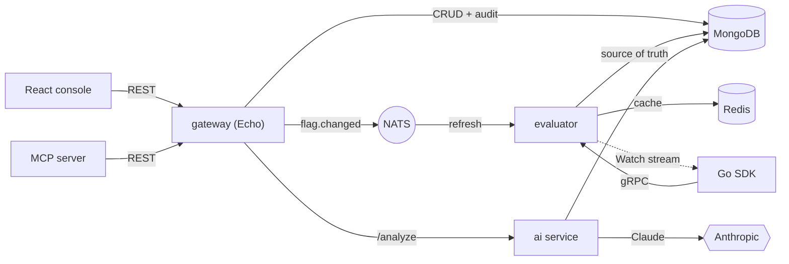

# flagcast

A feature-flag & experimentation platform — event-driven Go microservices, a
low-latency **gRPC** evaluation SDK, a React/TypeScript console, and
Claude-powered rollout analysis with an **MCP** server.

Flags live in MongoDB, are cached in Redis, and every change **broadcasts** over
NATS so evaluators and SDK clients update in near-real-time.

> Sibling to [sitemon](https://github.com/mralaminahamed/sitemon). flagcast
> deliberately covers what sitemon left out: a real gRPC surface, a cloud
> deployment, and distributed tracing.

## Architecture



- **gateway** — REST admin API for flags + audit + `/analyze`; publishes `flag.changed`.
- **evaluator** — gRPC `Evaluate`/`EvaluateAll`/`Watch`; Redis-cached, refreshed from NATS, periodic re-sync so a missed event never leaves the cache stale.
- **ai** — deterministic A/B stats (two-proportion z-test) + a Claude ship/hold/iterate recommendation (rule-based fallback with no key).
- **mcp** — stdio MCP server exposing flag tools to an agent, via the gateway.
- **console** — the switchboard UI: toggle flags, set rollouts, view audit, run analysis.

## Stack

Go 1.27 · gRPC + Protobuf (buf) · Echo · NATS · MongoDB · Redis · OpenTelemetry ·
Prometheus + Grafana · React 19 + TypeScript + Vite + Tailwind v4 · Anthropic SDK ·
Docker · GitHub Actions · Terraform (AWS ECS Fargate).

## Quick start

```bash
cp .env.example .env
make up                       # mongo, redis, nats, gateway, evaluator, ai, console
curl localhost:8080/health
open http://localhost:5173    # console
```

Observability profile (Jaeger + Prometheus + Grafana):

```bash
OTEL_EXPORTER_OTLP_ENDPOINT=http://jaeger:4317 \
  docker compose -f infra/docker-compose.yml --profile observability up -d
# Jaeger :16686 · Prometheus :9099 · Grafana :3099
```

## Go SDK

```go
c, _ := flagcast.Dial("localhost:50051")   // insecure by default; pass grpc opts for TLS
defer c.Close()

if c.BoolValue(ctx, "new-checkout", flagcast.Context{Key: userID}, false) {
    // new flow — unknown flags / errors fall back to the default
}

// live updates pushed over the Watch stream
go c.Watch(ctx, flagcast.Context{Key: userID}, func(ch flagcast.Change) { /* ... */ })
```

Set `FLAGCAST_API_KEY` to authenticate to a secured evaluator. Regenerate gRPC
stubs after editing `proto/`: `make proto`.

## MCP server

`apps/mcp` is a stdio MCP server exposing flags as tools an agent (e.g. Claude)
can call — `list_flags`, `get_flag`, `create_flag`, `set_enabled`, `set_rollout`,
`delete_flag` — all through the gateway REST API. Point an MCP client at:

```json
{
  "command": "/path/to/bin/mcp",
  "env": { "FLAGCAST_API": "http://localhost:8080", "FLAGCAST_API_KEY": "" }
}
```

## Observability

- **Metrics** on every service (`/metrics`): evaluations by reason, cache hit/miss,
  flag changes processed, active Watch streams, dropped updates, analyses by verdict,
  plus gateway HTTP RED.
- **Distributed tracing** (OpenTelemetry) across HTTP, gRPC, and NATS — a single
  trace follows a flag change gateway → NATS → evaluator, and the Claude call is a span.
- **Grafana dashboard** ("flagcast — Platform Overview") + **Prometheus alert rules**
  (service down, gateway error rate/latency, unknown-flag rate, watch drops).

## Security

- Gateway `/api` and the evaluator gRPC **fail closed** — no key configured means
  requests are refused (set `ALLOW_OPEN_API=true` for local dev).
- gRPC auth via `x-api-key`; reflection is off in prod.
- Rate limit, 1MB body limit, server timeouts, API key redacted from access logs.
- In AWS: secrets in Secrets Manager, DocumentDB + Redis encryption (at rest and
  in transit), optional HTTPS at the ALB.

## Deploy

- **Images:** `.github/workflows/images.yml` builds every service + the console to
  GHCR on push to `trunk` and on tags.
- **Cloud:** `infra/terraform` provisions AWS ECS Fargate (ALB, Cloud Map, DocumentDB,
  ElastiCache, ECR, health checks + deployment circuit breaker). See its README.
- **CD:** `.github/workflows/deploy.yml` runs `terraform apply` on manual dispatch
  via AWS OIDC (secrets + a remote Terraform backend required).

## Layout

```
apps/{gateway,evaluator,ai,mcp,console}
packages/
  shared/{store,cache,bus,eval,stats,validation,models,config,logger,health,metrics,tracing}
  sdk/                         # Go SDK
proto/flagcast/v1/             # gRPC contract (buf)
infra/{docker-compose.yml,prometheus,grafana,terraform}
```
