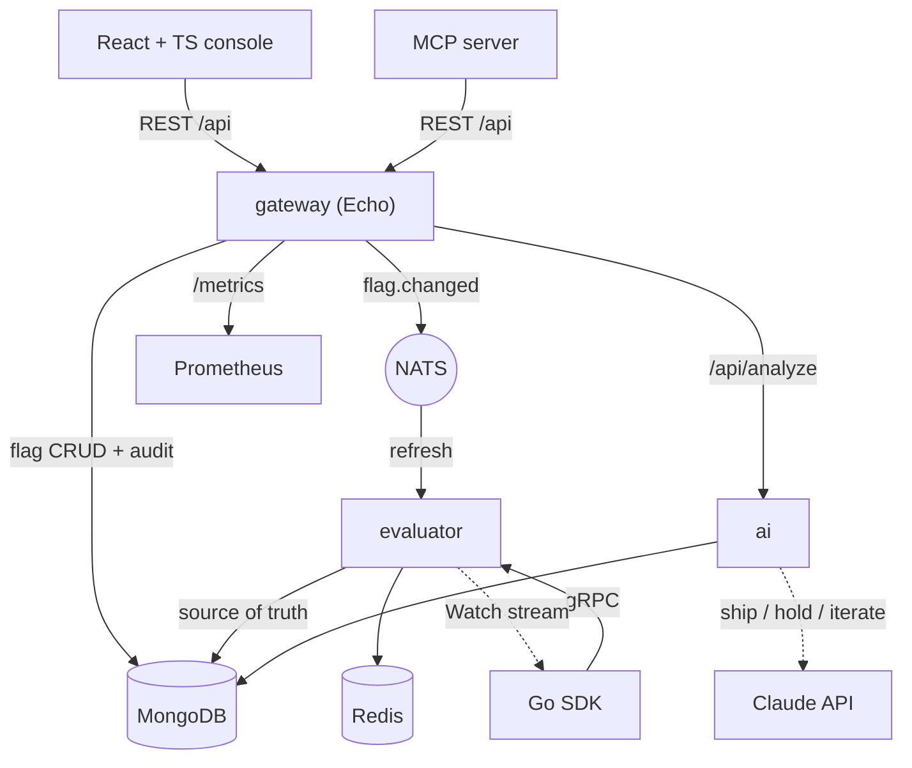

<div align="center">


# flagcast — Developer Guide

**Ship features safely — a feature-flag & experimentation platform where flags live in MongoDB, cache in Redis, evaluate over low-latency gRPC, and broadcast every change across Go microservices on NATS, with a React console and Claude-powered rollout analysis.**

[](https://go.dev/)
[](https://react.dev/)
[](https://grpc.io/)
[](https://nats.io/)
[](https://docs.anthropic.com/)
[](LICENSE)

</div>

## What it is

A feature-flag system is rarely one process. Something stores the flags and who
changed them, something evaluates them for a given user at very low latency,
something has to tell every running copy the instant a flag flips, and a person
wants to toggle and roll out from a screen. flagcast models that split as it
really is: independent Go services that talk over a message bus and a typed gRPC
contract, each doing one job and surviving the others being restarted.

The `gateway` is the control plane — a REST API to create, edit, toggle, and
roll out flags, with an audit trail — and it publishes a `flag.changed` event on
every mutation. The `evaluator` is the data plane: SDK clients call it over gRPC
for a flag decision (a deterministic percentage bucketing), it serves from a
Redis cache fronted over MongoDB, and it refreshes that cache from the NATS
stream — plus a periodic re-sync so a missed event never leaves a decision stale.
Clients can also open a `Watch` stream and get pushed updates. An `ai` service
runs A/B statistics and — when a key is present — asks Claude whether to ship,
hold, or iterate; an `mcp` server exposes the same flag operations as tools an
agent can call.

## Architecture



```
apps/
├── gateway/    Echo REST + audit, /metrics — flag CRUD, publishes flag.changed
├── evaluator/  gRPC Evaluate/EvaluateAll/Watch — Redis cache over Mongo, NATS refresh
├── ai/         A/B stats + Claude ship/hold/iterate (/analyze)
├── mcp/        stdio MCP server: list_flags, get_flag, create_flag, set_enabled…
└── console/    Vite + React 19 + TypeScript admin console

packages/
├── sdk/            Go SDK — Dial, BoolValue, Evaluate, Watch
└── shared/         store (Mongo) · cache (Redis) · bus (NATS) · eval · stats
                    models · config · logger · health · metrics · tracing · validation
proto/flagcast/v1/  gRPC contract (buf-generated stubs committed)

infra/              docker-compose.yml · prometheus · grafana · terraform (AWS)
```

Single Go module; each `apps/<service>/cmd` compiles to its own binary.

## Features

**Flags & evaluation**
- Flag model — key, name, description, enabled, rollout %, tags, timestamps
- **Deterministic bucketing** — stable fnv hash of `flagKey:contextKey`, independent per flag
- **gRPC SDK** — `Evaluate` / `EvaluateAll`, unknown flags fall back to the caller default
- **Watch stream** — server pushes re-evaluated changes to SDK clients in near-real-time
- Change history / audit trail in MongoDB (TTL-bounded)

**Distributed by design**
- NATS `flag.changed` events fan changes out to every evaluator
- Redis flag cache fronting Mongo, warmed at startup and **periodically re-synced** so a
  dropped event never leaves a decision permanently stale
- Graceful degradation — no Redis → Mongo reads; no NATS → cache still re-syncs

**AI**
- **A/B statistics** — two-proportion z-test (lift, p-value, significance)
- **Claude analysis** via the Anthropic Go SDK (`claude-opus-5`), gated on
  `ANTHROPIC_API_KEY` with a deterministic rule-based fallback without one
- **MCP server** exposing flag tools (`list_flags`, `set_rollout`, …) to any MCP client

**Console**
- React 19 + TypeScript "switchboard" — toggle, rollout meter, create/edit, audit
- Per-flag AI analysis, API-key settings, theme-aware light/dark

**Security**
- Gateway `/api` and evaluator gRPC **fail closed** — no key means requests are refused
- gRPC `x-api-key` auth, reflection off in prod; rate limit, body limit, server timeouts

**Operations**
- Prometheus metrics on every service; **OpenTelemetry** traces across HTTP/gRPC/NATS
- Grafana dashboard + alert rules; images to GHCR; Terraform for AWS ECS Fargate

## Requirements

- Go 1.27+
- Docker (for the local stack: MongoDB, Redis, NATS)
- Node 24 + pnpm (only to develop the console)
- `buf` + `protoc-gen-go` / `protoc-gen-go-grpc` (only to regenerate gRPC stubs)
- An `ANTHROPIC_API_KEY` is optional — the AI service runs without one

## Installation

```bash
git clone https://github.com/mralaminahamed/flagcast.git
cd flagcast
cp .env.example .env
make up
```

`make up` brings up MongoDB, Redis, NATS and every service. Then:

- Console — http://localhost:5173
- API — http://localhost:8080
- Evaluator gRPC — localhost:50051
- Metrics — http://localhost:8081/metrics (evaluator), :8080/metrics (gateway)
- Observability (Jaeger + Prometheus + Grafana):

```bash
OTEL_EXPORTER_OTLP_ENDPOINT=http://jaeger:4317 \
  docker compose -f infra/docker-compose.yml --profile observability up -d
# Jaeger :16686 · Prometheus :9099 · Grafana :3099
```

## Development

```bash
make build         # build every service binary
make test          # go test ./...
make test-race     # CGO_ENABLED=1 go test -race ./...
make lint          # go vet + gofmt check
make proto         # regenerate gRPC stubs from proto/
```

Full gate before committing:

```bash
gofmt -l apps packages && go vet ./... && go build ./... && CGO_ENABLED=1 go test -race ./...
```

CI (`.github/workflows/ci.yml`) runs the same gate plus `govulncheck` and the
console type-check/build on every push and PR; `.github/workflows/images.yml`
builds and pushes service + console images to GHCR on `trunk` and version tags.

### API

Namespace `/api`. Set `GATEWAY_API_KEY` (sent as `X-API-Key`) to authenticate;
without it, `/api` fails closed unless `ALLOW_OPEN_API=true`.

| Method | Route | Purpose |
|--------|-------|---------|
| GET | `/health` · `/ready` | Liveness · readiness |
| GET | `/api/flags` | List flags |
| POST | `/api/flags` | Create a flag |
| GET | `/api/flags/:key` | Get one flag |
| PUT | `/api/flags/:key` | Update a flag |
| DELETE | `/api/flags/:key` | Delete a flag |
| GET | `/api/audit?flag=&limit=` | Change history |
| POST | `/api/analyze` | AI rollout analysis (ship/hold/iterate) |
| GET | `/metrics` | Prometheus exposition |

### gRPC (evaluator)

Service `flagcast.v1.Evaluator` on `:50051` — contract in
[`proto/flagcast/v1/evaluator.proto`](proto/flagcast/v1/evaluator.proto).

| RPC | Purpose |
|-----|---------|
| `Evaluate` | Decide one flag for a context |
| `EvaluateAll` | Decide every flag for a context |
| `Watch` | Stream a snapshot then live changes |

### Event bus

| Subject | Producer | Consumer |
|---------|----------|----------|
| `flag.changed` | gateway | evaluator |

## Deploy

- **Local dev** — `make up` (`infra/docker-compose.yml`)
- **Cloud (AWS ECS Fargate)** — `infra/terraform` (see its [README](infra/terraform/README.md))
- **CD** — `.github/workflows/deploy.yml` runs `terraform apply` on manual dispatch via AWS OIDC

## Contributing

Branch from `trunk`, keep the full gate green, and open a pull request.

Commits follow [Conventional Commits](https://www.conventionalcommits.org/):

```
type(scope): description
```

Types `feat` `fix` `docs` `refactor` `perf` `test` `build` `ci` `chore` ·
scopes `gateway` `evaluator` `ai` `mcp` `console` `infra`.

Merge with a merge commit (not squash) so scoped commits stay in history.
Conventions in full: [`CLAUDE.md`](CLAUDE.md).

## License

MIT — see [LICENSE](LICENSE).
